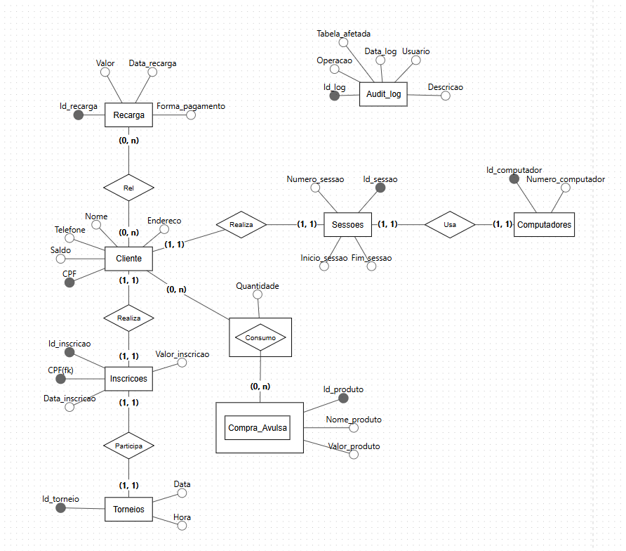

# Sistema Lan House Gamer

Este projeto acadêmico foi desenvolvido com o objetivo de aplicar os conceitos de modelagem e implementação de Banco de Dados em um cenário real de gerenciamento de uma LAN HOUSE GAMER.

O sistema foi modelado utilizando os níveis conceitual, lógico e relacional, permitindo o controle de clientes, sessões de uso, computadores, consumo de produtos, inscrições em torneios e gerenciamento de endereços.

A implementação foi realizada em MySQL, utilizando DDL para criação das tabelas, relacionamentos, chaves primárias e estrangeiras, além de comandos SQL para inserção e consulta de dados.

## Tecnologias utilizadas

* MySQL
* MySQL Workbench
* GitHub
* Modelagem de Banco de Dados

## Estrutura do projeto

* Modelo Conceitual
* Modelo Lógico
* DER
* Script SQL
* Dados de exemplo
* Consultas SQL

## Objetivo

Desenvolver uma solução de Banco de Dados organizada, funcional e normalizada para auxiliar no gerenciamento de uma LAN HOUSE GAMER.

## Autores

Projeto desenvolvido por:

* Gabriela Torres Guerra da Fonte
* Pedro Henrique Moreira Corrêa
* André César Santana de Oliveira

Instituição: UNIBRA
Curso: Análise e Desenvolvimento de Sistemas (ADS)

## Modelo Conceitual

## Modelo Lógico

